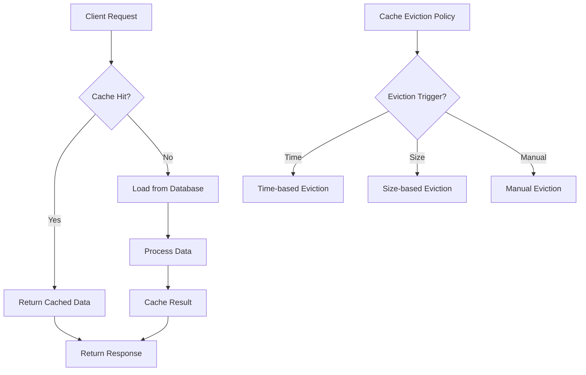

## Core Concepts

### 1. What is Spring Boot?
Spring Boot is an opinionated framework that simplifies the development of Spring applications. It reduces boilerplate code and provides a platform that helps you create stand-alone, production-grade applications with minimal effort. Spring Boot follows the \"Convention over Configuration\" principle, which means it provides default configurations that can be easily overridden when needed.

Key features include:
- Embedded server integration (Tomcat, Jetty, or Undertow)
- Automatic configuration of Spring beans based on classpath dependencies
- Health checks and metrics through Actuator
- External configuration support
- No code generation and no XML configuration required

### 2. What are the advantages of Spring Boot?
Spring Boot offers numerous advantages that make it a popular choice for modern application development:

1. Opinionated 'starter' dependencies:
   - Curated dependencies that work together seamlessly
   - Eliminates version conflicts
   - Example: spring-boot-starter-web includes everything needed for web development

2. Automatic configuration:
   - Configures Spring beans based on classpath dependencies
   - Reduces manual configuration
   - Example: Adding H2 database dependency automatically configures an in-memory database

3. Embedded server support:
   - Applications are self-contained
   - No need to deploy WAR files
   - Simplified deployment process

4. Microservices support:
   - Built-in support for microservices architecture
   - Easy integration with Spring Cloud
   - Service discovery, configuration management, and circuit breakers

5. Production-ready features:
   - Health checks through /actuator/health
   - Metrics through /actuator/metrics
   - External configuration support
   - Logging and monitoring capabilities

### 3. What is Spring Boot Autoconfiguration?
Spring Boot Autoconfiguration is a powerful feature that automatically configures your Spring application based on the dependencies present on the classpath. It works through a combination of conditional annotations and configuration classes.

How it works:
1. Spring Boot scans for dependencies in your classpath
2. Based on found dependencies, it creates appropriate beans
3. These configurations can be overridden with custom configurations

Example:
```java
@SpringBootApplication
public class MyApplication {
    public static void main(String[] args) {
        SpringApplication.run(MyApplication.class, args);
    }
}
```

When you add spring-boot-starter-data-jpa:
- Automatically configures a DataSource
- Sets up EntityManagerFactory
- Configures transaction management

You can view auto-configuration report by adding --debug to your application run arguments.

### 4. What is a Spring Boot Starter?
A Spring Boot Starter is a curated set of compatible dependencies that can be included in your application. Starters significantly simplify dependency management by providing a single dependency instead of multiple related ones.

Common starters:
1. spring-boot-starter-web
   - Spring MVC
   - Embedded Tomcat
   - Jackson for JSON processing
   - Validation

2. spring-boot-starter-data-jpa
   - Hibernate
   - Spring Data JPA
   - Database connection pool

Example usage in pom.xml:
```xml
<dependency>
    <groupId>org.springframework.boot</groupId>
    <artifactId>spring-boot-starter-web</artifactId>
</dependency>
```

### 5. Explain Spring Boot Actuator?
Spring Boot Actuator is a powerful feature that adds production-ready monitoring and management capabilities to your application. It provides numerous endpoints that help you monitor and interact with your application.

Key features:
1. Health monitoring
   - /actuator/health shows application health status
   - Custom health indicators can be added
   ```java
   @Component
   public class CustomHealthIndicator implements HealthIndicator {
       @Override
       public Health health() {
           return Health.up()
                      .withDetail(\"customKey\", \"customValue\")
                      .build();
       }
   }
   ```

2. Metrics
   - /actuator/metrics shows various metrics
   - Integration with monitoring systems like Prometheus
   - Custom metrics can be added using MeterRegistry

3. Environment information
   - /actuator/env shows environment variables
   - /actuator/configprops shows configuration properties

4. Thread dump and heap dump
   - /actuator/threaddump for thread analysis
   - /actuator/heapdump for memory analysis

Configuration example:
```properties
# Enable all endpoints
management.endpoints.web.exposure.include=*

# Enable specific endpoints
management.endpoints.web.exposure.include=health,metrics,info


## Configuration

### 6. What are different ways to configure a Spring Boot application?
Spring Boot provides multiple flexible options for configuring your application, each serving different needs and use cases. Understanding these options helps you choose the most appropriate approach for your specific requirements.

1. Application Properties Files:
   The most common approach is using application.properties or application.yml files. These files can be placed in different locations with different precedence:

   ```properties
   # application.properties example
   server.port=8080
   spring.datasource.url=jdbc:mysql://localhost:3306/mydb
   spring.jpa.hibernate.ddl-auto=update
   ```

   ```yaml
   # application.yml example
   server:
     port: 8080
   spring:
     datasource:
       url: jdbc:mysql://localhost:3306/mydb
     jpa:
       hibernate:
         ddl-auto: update
   ```

2. Command-line Arguments:
   You can override properties when starting the application:
   ```bash
   java -jar myapp.jar --server.port=8081
   ```

3. Environment Variables:
   System environment variables can be used for configuration:
   ```bash
   export SERVER_PORT=8081
   ```
   Spring Boot automatically converts environment variables from uppercase underscore format to lowercase dot format.

4. @Configuration Classes:
   Java-based configuration provides type-safe configuration:
   ```java
   @Configuration
   public class DatabaseConfig {
       @Bean
       public DataSource dataSource() {
           HikariDataSource dataSource = new HikariDataSource();
           dataSource.setJdbcUrl(\"jdbc:mysql://localhost:3306/mydb\");
           dataSource.setUsername(\"user\");
           dataSource.setPassword(\"password\");
           return dataSource;
       }
   }
   ```

5. Cloud Config Server:
   For distributed systems, Spring Cloud Config Server provides centralized configuration:
   ```yaml
   spring:
     cloud:
       config:
         uri: http://config-server:8888
         label: master
   ```

The order of precedence (from highest to lowest) is:
1. Command-line arguments
2. Java System properties
3. OS environment variables
4. Application properties files
5. @Configuration classes

### 7. What is the default port of Spring Boot application and how to customize it?
Spring Boot applications by default run on port 8080, but this can be easily customized in several ways to suit your needs.

Ways to change the port:

1. Using application.properties:
   ```properties
   server.port=8081
   ```

2. Using application.yml:
   ```yaml
   server:
     port: 8081
   ```

3. Using environment variable:
   ```bash
   export SERVER_PORT=8081
   ```

4. Programmatically:
   ```java
   @SpringBootApplication
   public class MyApplication {
       public static void main(String[] args) {
           SpringApplication app = new SpringApplication(MyApplication.class);
           app.setDefaultProperties(Collections.singletonMap(\"server.port\", \"8081\"));
           app.run(args);
       }
   }
   ```

Special port values:
- 0: Random port (useful for testing)
- -1: Disable HTTP connector

Example for random port in tests:
```java
@SpringBootTest(webEnvironment = SpringBootTest.WebEnvironment.RANDOM_PORT)
class MyApplicationTests {
    @LocalServerPort
    private int port;

    @Test
    void contextLoads() {
        // Test using dynamic port
    }
}
```

### 8. How to disable specific auto-configuration?
Spring Boot's auto-configuration can be selectively disabled when you need more control over your application's configuration. There are several ways to achieve this:

1. Using @EnableAutoConfiguration exclude:
   ```java
   @SpringBootApplication(exclude = {DataSourceAutoConfiguration.class})
   public class MyApplication {
       public static void main(String[] args) {
           SpringApplication.run(MyApplication.class, args);
       }
   }
   ```

2. Using properties file:
   ```properties
   spring.autoconfigure.exclude=org.springframework.boot.autoconfigure.jdbc.DataSourceAutoConfiguration
   ```

3. Multiple exclusions:
   ```java
   @EnableAutoConfiguration(exclude = {
       DataSourceAutoConfiguration.class,
       HibernateJpaAutoConfiguration.class,
       JpaRepositoriesAutoConfiguration.class
   })
   ```

4. Conditional exclusion:
   ```java
   @ConditionalOnProperty(name = \"some.property\", havingValue = \"false\")
   @Configuration
   public class MyAutoConfiguration {
       // Configuration to be conditionally excluded
   }
   ```

Best practices:
- Always verify the impact of disabling auto-configuration
- Consider using configuration properties before disabling auto-configuration
- Document why auto-configuration was disabled
- Use condition annotations for more fine-grained control

### 9. What is Spring Boot DevTools?
Spring Boot DevTools (Developer Tools) is a set of tools that makes application development more convenient. It provides several features that enhance the development experience:

1. Automatic Restart:
   The application automatically restarts when files on the classpath change:
   ```xml
   <dependency>
       <groupId>org.springframework.boot</groupId>
       <artifactId>spring-boot-devtools</artifactId>
       <optional>true</optional>
   </dependency>
   ```

2. Live Reload:
   Automatically refreshes the browser when resources change:
   ```properties
   spring.devtools.livereload.enabled=true
   ```

3. Property Defaults:
   DevTools sets certain properties suitable for development:
   - Disables template caching
   - Enables debug logging for web group
   - Enables H2 console

4. Remote Development Support:
   ```properties
   spring.devtools.remote.secret=mysecret
   ```

Example configuration class:
```java
@Configuration
public class DevToolsConfig {
    @Bean
    public DevToolsPropertyDefaultsPostProcessor devToolsPropertyDefaultsPostProcessor() {
        return new DevToolsPropertyDefaultsPostProcessor();
    }
}
```

Best practices:
- Disable DevTools in production
- Configure trigger file for more control over restarts
- Use excludes to prevent unnecessary restarts
- Configure specific paths for monitoring


# Configure security
management.endpoint.health.show-details=always
```
### 10. How to change the port in Spring Boot application and understand port configuration?
Understanding port configuration in Spring Boot goes beyond simply changing a number. The port configuration affects how your application is accessed and can impact your deployment strategy. Let's explore this in detail:

Port Configuration Methods:
```properties
# Basic port configuration
server.port=8081

# Random port (useful for testing)
server.port=0

# Disable embedded server
server.port=-1

# Different ports for HTTPS
server.port=8443
server.ssl.enabled=true

# Configure HTTP port when HTTPS is enabled
server.http.port=8080
```

Advanced Port Configuration:
```java
@Component
public class PortConfiguration {
    @Value(\"${server.port:8080}\")
    private int serverPort;
    
    @PostConstruct
    public void checkPort() {
        if (serverPort < 1024) {
            logger.warn(\"Using system ports (below 1024) requires root privileges\");
        }
    }
}
```

Port Configuration in Different Environments:
```yaml
# application.yml
spring:
  profiles:
    group:
      development:
        - dev
      production:
        - prod

---
spring:
  config:
    activate:
      on-profile: dev
server:
  port: 8080

---
spring:
  config:
    activate:
      on-profile: prod
server:
  port: ${PORT:8080}
```

## Dependencies and Build

### 11. What is the importance of spring-boot-starter-parent?
The spring-boot-starter-parent is a special starter that provides default configurations and dependency management for Spring Boot applications. It's crucial to understand its role in maintaining consistency and simplifying dependency management.

Maven Configuration:
```xml
<parent>
    <groupId>org.springframework.boot</groupId>
    <artifactId>spring-boot-starter-parent</artifactId>
    <version>2.7.0</version>
</parent>
```

Key Benefits:

1. Default Plugin Configuration:
```xml
<!-- These configurations are inherited automatically -->
<properties>
    <java.version>11</java.version>
    <project.build.sourceEncoding>UTF-8</project.build.sourceEncoding>
    <project.reporting.outputEncoding>UTF-8</project.reporting.outputEncoding>
</properties>
```

2. Dependency Management:
```xml
<!-- No version needed for Spring Boot managed dependencies -->
<dependencies>
    <dependency>
        <groupId>org.springframework.boot</groupId>
        <artifactId>spring-boot-starter-web</artifactId>
    </dependency>
</dependencies>
```

3. Resource Filtering:
```properties
# application.properties
app.version=@project.version@
build.timestamp=@maven.build.timestamp@
```

Alternative Without Parent:
```xml
<dependencyManagement>
    <dependencies>
        <dependency>
            <groupId>org.springframework.boot</groupId>
            <artifactId>spring-boot-dependencies</artifactId>
            <version>2.7.0</version>
            <type>pom</type>
            <scope>import</scope>
        </dependency>
    </dependencies>
</dependencyManagement>
```

### 12. Understanding Spring Boot Minimal Configuration
A minimal Spring Boot application requires several key components working together. Let's explore each component and understand why it's necessary:

1. Main Application Class:
```java
@SpringBootApplication
public class MinimalApplication {
    public static void main(String[] args) {
        SpringApplication.run(MinimalApplication.class, args);
    }
}
```

2. Essential Dependencies:
```xml
<parent>
    <groupId>org.springframework.boot</groupId>
    <artifactId>spring-boot-starter-parent</artifactId>
    <version>2.7.0</version>
</parent>

<dependencies>
    <dependency>
        <groupId>org.springframework.boot</groupId>
        <artifactId>spring-boot-starter</artifactId>
    </dependency>
</dependencies>
```

3. Application Properties:
```properties
# Minimal application.properties
spring.application.name=minimal-app
```

Understanding @SpringBootApplication:
```java
@Target(ElementType.TYPE)
@Retention(RetentionPolicy.RUNTIME)
@Documented
@Inherited
@SpringBootConfiguration
@EnableAutoConfiguration
@ComponentScan
public @interface SpringBootApplication {
    // ... annotation attributes
}
```

Component Scanning:
```java
@Component
class MinimalComponent {
    @PostConstruct
    void init() {
        System.out.println(\"Minimal component initialized\");
    }
}
```

### 13. Deep Dive into Spring Initializr
Spring Initializr is more than just a project generator - it's a sophisticated tool that helps create properly structured Spring Boot applications. Let's explore its capabilities:

Web Interface Usage:
1. Visit start.spring.io
2. Configure project metadata:
```properties
Group: com.example
Artifact: demo
Name: demo
Description: Demo project
Package name: com.example.demo
Packaging: Jar
Java: 17
```

REST API Usage:
```bash
curl https://start.spring.io/starter.zip \\
    -d type=maven-project \\
    -d language=java \\
    -d bootVersion=2.7.0 \\
    -d baseDir=my-app \\
    -d groupId=com.example \\
    -d artifactId=my-app \\
    -o my-app.zip
```

Custom Initializr Configuration:
```yaml
initializr:
  dependencies:
    - name: Web
      content:
        - name: Spring Web
          id: web
        - name: Spring WebFlux
          id: webflux
    - name: Database
      content:
        - name: Spring Data JPA
          id: data-jpa
```

Generated Project Structure:
```
my-app/
├── src/
│   ├── main/
│   │   ├── java/
│   │   │   └── com/
│   │   │       └── example/
│   │   │           └── myapp/
│   │   │               └── MyAppApplication.java
│   │   └── resources/
│   │       └── application.properties
│   └── test/
│       └── java/
│           └── com/
│               └── example/
│                   └── myapp/
│                       └── MyAppApplicationTests.java
├── .gitignore
├── pom.xml
└── README.md
```
### 14. Understanding Spring Boot Profiles in Depth

Spring Boot profiles provide a powerful way to segregate parts of your application configuration and make them available only in specific environments. Understanding profiles is crucial for managing different deployment scenarios effectively.

Let's explore how profiles work in a Spring Boot application:

First, let's understand the profile activation flow:


Profile Configuration Methods:

1. Using Properties Files:
```properties
# application-dev.properties
server.port=8080
spring.jpa.hibernate.ddl-auto=create-drop
logging.level.org.springframework=DEBUG

# application-prod.properties
server.port=80
spring.jpa.hibernate.ddl-auto=none
logging.level.org.springframework=ERROR
```

2. Using YAML with Profile-Specific Properties:
```yaml
spring:
  profiles:
    active: dev
---
spring:
  config:
    activate:
      on-profile: dev
database:
  url: jdbc:h2:mem:devdb
  
---
spring:
  config:
    activate:
      on-profile: prod
database:
  url: jdbc:mysql://localhost/proddb
```

3. Profile-Specific Beans:
```java
@Configuration
public class DatabaseConfig {
    
    @Profile(\"dev\")
    @Bean
    public DataSource devDataSource() {
        return DataSourceBuilder.create()
            .url(\"jdbc:h2:mem:devdb\")
            .username(\"sa\")
            .password(\"\")
            .build();
    }
    
    @Profile(\"prod\")
    @Bean
    public DataSource prodDataSource() {
        return DataSourceBuilder.create()
            .url(\"jdbc:mysql://localhost/proddb\")
            .username(\"root\")
            .password(\"secret\")
            .build();
    }
}
```

4. Profile Activation Methods:

Through Application Properties:
```properties
spring.profiles.active=dev,mysql
```

Programmatically:
```java
@SpringBootApplication
public class MyApplication {
    public static void main(String[] args) {
        SpringApplication app = new SpringApplication(MyApplication.class);
        app.setAdditionalProfiles(\"dev\");
        app.run(args);
    }
}
```

Through Environment Variables:
```bash
export SPRING_PROFILES_ACTIVE=dev
```

Through Maven:
```xml
<profiles>
    <profile>
        <id>dev</id>
        <properties>
            <spring.profiles.active>dev</spring.profiles.active>
        </properties>
    </profile>
</profiles>
```

5. Profile Groups:
Spring Boot 2.4 introduced profile groups to simplify profile activation:

```yaml
spring:
  profiles:
    group:
      development:
        - dev
        - debug
        - h2
      production:
        - prod
        - mysql
        - cloud
```

Best Practices for Profile Usage:

1. Default Profile Configuration:
```java
@Configuration
@Profile(\"default\")
public class DefaultConfig {
    // Configuration when no profile is explicitly set
}
```

2. Profile-Specific Tests:
```java
@SpringBootTest
@ActiveProfiles(\"test\")
class ProfileSpecificTests {
    
    @Test
    void whenTestProfile_thenTestConfigurationLoaded() {
        // Test with test profile configuration
    }
}
```

3. Profile-Based Security:
```java
@Configuration
@Profile(\"prod\")
public class SecurityConfig extends WebSecurityConfigurerAdapter {
    @Override
    protected void configure(HttpSecurity http) throws Exception {
        http.requiresChannel()
            .anyRequest()
            .requiresSecure();
    }
}
```

Understanding Profile Precedence:
Spring Boot loads application properties in a specific order:

1. Application properties in the classpath
2. Profile-specific properties
3. Externalized configuration
4. Command-line arguments

Let's look at how auto-configuration works with profiles:


### 15. Spring Boot Application Lifecycle and Startup Process

Understanding how a Spring Boot application starts up and processes requests is crucial for developing and debugging applications effectively. Let's explore the complete lifecycle, from application startup to request handling.


The Spring Boot startup process involves several crucial phases:

1. Bootstrap Phase:
```java
@SpringBootApplication
public class MyApplication {
    public static void main(String[] args) {
        // Initialize the bootstrap context
        SpringApplication application = new SpringApplication(MyApplication.class);
        
        // Configure the bootstrap process
        application.setBannerMode(Banner.Mode.CONSOLE);
        application.setWebApplicationType(WebApplicationType.SERVLET);
        
        // Run the application
        ConfigurableApplicationContext context = application.run(args);
    }
}
```

2. Environment Preparation:
```java
@Configuration
public class EnvironmentConfig {
    @Bean
    public static PropertySourcesPlaceholderConfigurer properties() {
        PropertySourcesPlaceholderConfigurer configurer = 
            new PropertySourcesPlaceholderConfigurer();
        
        // Add custom property sources
        YamlPropertiesFactoryBean yaml = new YamlPropertiesFactoryBean();
        yaml.setResources(new ClassPathResource(\"custom-config.yml\"));
        configurer.setProperties(yaml.getObject());
        
        return configurer;
    }
}
```

3. Application Context Creation:
The ApplicationContext creation process follows a specific order:


4. Bean Lifecycle Management:
```java
@Component
public class LifecycleBean implements InitializingBean, DisposableBean {
    
    @PostConstruct
    public void init() {
        // Initialization code after dependency injection
        System.out.println(\"Bean initialized through @PostConstruct\");
    }
    
    @Override
    public void afterPropertiesSet() {
        // InitializingBean initialization
        System.out.println(\"Bean initialized through InitializingBean\");
    }
    
    @PreDestroy
    public void cleanup() {
        // Cleanup code before bean destruction
        System.out.println(\"Bean cleanup through @PreDestroy\");
    }
    
    @Override
    public void destroy() {
        // DisposableBean cleanup
        System.out.println(\"Bean cleanup through DisposableBean\");
    }
}
```

5. Request Processing Pipeline:


Let's explore how a typical request flows through the application:

```java
@RestController
@RequestMapping(\"/api\")
public class UserController {
    
    private final UserService userService;
    private final RequestTracker requestTracker;
    
    public UserController(UserService userService, RequestTracker requestTracker) {
        this.userService = userService;
        this.requestTracker = requestTracker;
    }
    
    @GetMapping(\"/users/{id}\")
    public ResponseEntity<User> getUser(@PathVariable Long id) {
        // Request tracking
        requestTracker.logRequest(\"Getting user with ID: \" + id);
        
        try {
            // Service layer interaction
            User user = userService.findById(id);
            
            // Response processing
            return ResponseEntity
                .ok()
                .cacheControl(CacheControl.maxAge(30, TimeUnit.MINUTES))
                .body(user);
                
        } catch (UserNotFoundException ex) {
            // Error handling
            return ResponseEntity
                .notFound()
                .build();
        }
    }
}
```

Understanding Error Handling in the Request Pipeline:

```java
@ControllerAdvice
public class GlobalExceptionHandler extends ResponseEntityExceptionHandler {
    
    @ExceptionHandler(UserNotFoundException.class)
    public ResponseEntity<ErrorResponse> handleUserNotFound(
            UserNotFoundException ex, WebRequest request) {
            
        ErrorResponse error = new ErrorResponse(
            HttpStatus.NOT_FOUND.value(),
            ex.getMessage(),
            request.getDescription(false)
        );
        
        return new ResponseEntity<>(error, HttpStatus.NOT_FOUND);
    }
    
    @ExceptionHandler(Exception.class)
    public ResponseEntity<ErrorResponse> handleAllUncaughtException(
            Exception ex, WebRequest request) {
            
        ErrorResponse error = new ErrorResponse(
            HttpStatus.INTERNAL_SERVER_ERROR.value(),
            \"An unexpected error occurred\",
            request.getDescription(false)
        );
        
        return new ResponseEntity<>(error, HttpStatus.INTERNAL_SERVER_ERROR);
    }
}
```

Security Integration in the Request Pipeline:

```java
@Configuration
@EnableWebSecurity
public class SecurityConfig extends WebSecurityConfigurerAdapter {
    
    @Override
    protected void configure(HttpSecurity http) throws Exception {
        http
            .authorizeRequests()
                .antMatchers(\"/api/public/**\").permitAll()
                .antMatchers(\"/api/users/**\").hasRole(\"USER\")
                .antMatchers(\"/api/admin/**\").hasRole(\"ADMIN\")
                .anyRequest().authenticated()
            .and()
            .addFilterBefore(
                new JwtAuthenticationFilter(),
                UsernamePasswordAuthenticationFilter.class
            );
    }
}
```
### 16. Data Access Layer Architecture and Patterns in Spring Boot

The data access layer is a crucial component of any Spring Boot application, serving as the bridge between your business logic and the database. Let's explore how Spring Boot implements this layer effectively.

First, let's visualize the typical data access architecture:


Let's explore each component in detail:

1. Entity Layer Implementation:
```java
@Entity
@Table(name = \"users\")
public class User {
    @Id
    @GeneratedValue(strategy = GenerationType.IDENTITY)
    private Long id;
    
    @Column(nullable = false)
    private String username;
    
    @Column(nullable = false)
    private String email;
    
    // Using @Version for optimistic locking
    @Version
    private Long version;
    
    // Implementing auditing fields
    @CreatedDate
    @Column(updatable = false)
    private LocalDateTime createdAt;
    
    @LastModifiedDate
    private LocalDateTime updatedAt;
    
    // Bidirectional relationship example
    @OneToMany(mappedBy = \"user\", cascade = CascadeType.ALL)
    private Set<Order> orders = new HashSet<>();
    
    // Adding helper method for relationship management
    public void addOrder(Order order) {
        orders.add(order);
        order.setUser(this);
    }
}
```

2. Repository Layer with Advanced Features:
```java
@Repository
public interface UserRepository extends JpaRepository<User, Long> {
    // Custom query using method naming convention
    Optional<User> findByEmailIgnoreCase(String email);
    
    // Using @Query for complex queries
    @Query(\"\"\"
        SELECT u FROM User u
        LEFT JOIN FETCH u.orders
        WHERE u.createdAt >= :startDate
        AND u.active = true
        ORDER BY u.createdAt DESC
        \"\"\")
    List<User> findActiveUsersWithOrders(
        @Param(\"startDate\") LocalDateTime startDate);
    
    // Using Specification for dynamic queries
    @Query(\"\"\"
        SELECT DISTINCT u FROM User u
        LEFT JOIN FETCH u.orders o
        WHERE (:username IS NULL OR u.username LIKE %:username%)
        AND (:email IS NULL OR u.email = :email)
        AND (:minOrders IS NULL OR SIZE(u.orders) >= :minOrders)
        \"\"\")
    List<User> findUsersByDynamicCriteria(
        @Param(\"username\") String username,
        @Param(\"email\") String email,
        @Param(\"minOrders\") Integer minOrders);
}
```

3. Service Layer with Transaction Management:
```java
@Service
@Transactional(readOnly = true)
public class UserService {
    private final UserRepository userRepository;
    private final PasswordEncoder passwordEncoder;
    private final CacheManager cacheManager;
    
    public UserService(
            UserRepository userRepository,
            PasswordEncoder passwordEncoder,
            CacheManager cacheManager) {
        this.userRepository = userRepository;
        this.passwordEncoder = passwordEncoder;
        this.cacheManager = cacheManager;
    }
    
    @Transactional
    public User createUser(UserRegistrationDTO registrationDTO) {
        // Validate business rules
        validateUserRegistration(registrationDTO);
        
        // Create user entity
        User user = new User();
        user.setUsername(registrationDTO.getUsername());
        user.setEmail(registrationDTO.getEmail());
        user.setPassword(passwordEncoder.encode(
            registrationDTO.getPassword()));
        
        // Save and flush to get generated ID
        user = userRepository.saveAndFlush(user);
        
        // Clear relevant caches
        cacheManager.getCache(\"usersByEmail\")
            .evict(user.getEmail());
        
        return user;
    }
    
    @Cacheable(value = \"users\", key = \"#id\", unless = \"#result == null\")
    public Optional<User> findById(Long id) {
        return userRepository.findById(id);
    }
    
    @Transactional
    public User updateUser(Long id, UserUpdateDTO updateDTO) {
        return userRepository.findById(id)
            .map(user -> {
                // Update fields
                user.setUsername(updateDTO.getUsername());
                user.setEmail(updateDTO.getEmail());
                
                // Hibernate will automatically update
                return user;
            })
            .orElseThrow(() -> new UserNotFoundException(id));
    }
}
```

4. Implementing Caching Strategies:
```java
@Configuration
@EnableCaching
public class CacheConfig {
    @Bean
    public CacheManager cacheManager() {
        SimpleCacheManager cacheManager = new SimpleCacheManager();
        
        // Configure caches with different settings
        List<CaffeineCache> caches = Arrays.asList(
            // Cache for frequently accessed users
            buildCache(\"users\", 500, 10),
            // Cache for user email lookups
            buildCache(\"usersByEmail\", 1000, 30),
            // Cache for static data
            buildCache(\"configurations\", 100, 60)
        );
        
        cacheManager.setCaches(caches);
        return cacheManager;
    }
    
    private CaffeineCache buildCache(
            String name, int maxSize, int expireAfterWrite) {
        return new CaffeineCache(name, Caffeine.newBuilder()
            .maximumSize(maxSize)
            .expireAfterWrite(Duration.ofMinutes(expireAfterWrite))
            .recordStats()
            .build());
    }
}
```

5. Implementing Asynchronous Operations:
```java
@Service
public class AsyncUserService {
    private final UserRepository userRepository;
    private final EmailService emailService;
    
    @Async
    public CompletableFuture<List<User>> findUsersAsync(
            String emailDomain) {
        return CompletableFuture.supplyAsync(() -> 
            userRepository.findByEmailEndingWith(emailDomain));
    }
    
    @Async
    public CompletableFuture<Void> sendWelcomeEmails(
            List<User> newUsers) {
        return CompletableFuture.runAsync(() -> {
            newUsers.forEach(user -> 
                emailService.sendWelcomeEmail(user.getEmail()));
        });
    }
}
```

### 17. Understanding Transaction Management in Spring Boot

Transaction management is one of the most critical aspects of enterprise applications. Let's explore how Spring Boot handles transactions and how we can implement them effectively in our applications.

First, let's visualize how a transaction flows through a Spring Boot application:


Let's explore transaction management through a real-world example of a banking application:

```java
@Service
@Transactional(readOnly = true)  // Default to read-only for better performance
public class BankingService {
    private final AccountRepository accountRepository;
    private final TransactionRepository transactionRepository;
    private final NotificationService notificationService;
    
    // Constructor injection ensures required dependencies are provided
    public BankingService(
            AccountRepository accountRepository,
            TransactionRepository transactionRepository,
            NotificationService notificationService) {
        this.accountRepository = accountRepository;
        this.transactionRepository = transactionRepository;
        this.notificationService = notificationService;
    }
    
    // Money transfer demonstrates transaction properties
    @Transactional(
        isolation = Isolation.REPEATABLE_READ,  // Prevent dirty reads and non-repeatable reads
        rollbackFor = {InsufficientFundsException.class, AccountNotFoundException.class},
        timeout = 30  // Set transaction timeout to 30 seconds
    )
    public TransferResult transferMoney(
            Long fromAccountId, 
            Long toAccountId, 
            BigDecimal amount) {
            
        // Step 1: Load accounts with pessimistic locking to prevent concurrent modifications
        Account fromAccount = accountRepository.findByIdWithLock(fromAccountId)
            .orElseThrow(() -> new AccountNotFoundException(fromAccountId));
            
        Account toAccount = accountRepository.findByIdWithLock(toAccountId)
            .orElseThrow(() -> new AccountNotFoundException(toAccountId));
            
        // Step 2: Validate business rules
        if (fromAccount.getBalance().compareTo(amount) < 0) {
            throw new InsufficientFundsException(
                \"Insufficient funds in account: \" + fromAccountId);
        }
        
        // Step 3: Perform the transfer
        fromAccount.debit(amount);
        toAccount.credit(amount);
        
        // Step 4: Save the updated account states
        accountRepository.save(fromAccount);
        accountRepository.save(toAccount);
        
        // Step 5: Record the transaction
        TransactionRecord record = TransactionRecord.builder()
            .fromAccount(fromAccount)
            .toAccount(toAccount)
            .amount(amount)
            .timestamp(LocalDateTime.now())
            .status(TransactionStatus.COMPLETED)
            .build();
            
        transactionRepository.save(record);
        
        // Step 6: Send notifications (demonstrating transaction boundaries)
        try {
            // This runs in same transaction - failure will cause rollback
            notificationService.sendTransferConfirmation(
                fromAccount.getEmail(), 
                toAccount.getEmail(), 
                amount);
        } catch (NotificationException e) {
            // Log error but don't rollback the transaction
            log.error(\"Failed to send notification\", e);
        }
        
        return new TransferResult(record.getId(), \"Transfer completed successfully\");
    }
}
```

Now let's explore transaction propagation with a more complex scenario:

```java
@Service
public class AuditingService {
    private final AuditRepository auditRepository;
    
    // REQUIRES_NEW ensures audit records are saved regardless of parent transaction
    @Transactional(propagation = Propagation.REQUIRES_NEW)
    public void auditOperation(String operation, String details) {
        AuditRecord record = new AuditRecord();
        record.setOperation(operation);
        record.setDetails(details);
        record.setTimestamp(LocalDateTime.now());
        auditRepository.save(record);
    }
}

@Service
@Transactional
public class OrderService {
    private final OrderRepository orderRepository;
    private final InventoryService inventoryService;
    private final AuditingService auditingService;
    
    public OrderResult createOrder(OrderRequest request) {
        // Start main transaction
        Order order = new Order(request);
        
        try {
            // Update inventory (uses existing transaction)
            inventoryService.updateInventory(request.getItems());
            
            // Save order
            orderRepository.save(order);
            
            // Audit runs in new transaction (will commit even if main transaction fails)
            auditingService.auditOperation(
                \"CREATE_ORDER\", 
                \"Order created: \" + order.getId());
                
            return new OrderResult(order.getId(), \"Order created successfully\");
            
        } catch (Exception e) {
            // Main transaction will roll back, but audit record remains
            throw new OrderProcessingException(\"Failed to create order\", e);
        }
    }
}
```

Understanding transaction isolation levels is crucial. Here's a practical example demonstrating different isolation levels:

```java
@Service
public class ReportingService {
    private final TransactionRepository transactionRepository;
    
    // Read committed is sufficient for reporting
    @Transactional(isolation = Isolation.READ_COMMITTED)
    public DailyReport generateDailyReport(LocalDate date) {
        return new DailyReport(
            transactionRepository.sumTransactionsForDate(date),
            transactionRepository.countTransactionsForDate(date)
        );
    }
    
    // Serializable for critical financial calculations
    @Transactional(isolation = Isolation.SERIALIZABLE)
    public void reconcileDailyTransactions(LocalDate date) {
        List<Transaction> transactions = 
            transactionRepository.findAllByDate(date);
            
        BigDecimal totalAmount = BigDecimal.ZERO;
        for (Transaction tx : transactions) {
            totalAmount = totalAmount.add(tx.getAmount());
        }
        
        // Verify against daily summary
        DailySummary summary = 
            transactionRepository.findDailySummary(date);
            
        if (summary.getTotal().compareTo(totalAmount) != 0) {
            throw new ReconciliationException(
                \"Daily summary mismatch for date: \" + date);
        }
    }
}
```
### 18. Implementing Advanced Caching Strategies in Spring Boot

Caching is a critical performance optimization technique in enterprise applications. Let's explore how to implement effective caching strategies in Spring Boot.

First, let's understand the caching flow:



Let's implement a multi-level caching strategy:

```java
@Configuration
@EnableCaching
public class MultiLevelCacheConfig {
    
    @Bean
    public CacheManager cacheManager() {
        // Create a composite cache manager for multi-level caching
        CompositeCacheManager compositeCacheManager = new CompositeCacheManager();
        
        // First level: Caffeine (in-memory) cache
        CaffeineCacheManager caffeineCacheManager = new CaffeineCacheManager();
        caffeineCacheManager.setCaffeine(Caffeine.newBuilder()
            .maximumSize(1000)
            .expireAfterWrite(Duration.ofMinutes(10))
            .recordStats());
            
        // Second level: Redis distributed cache
        RedisCacheManager redisCacheManager = RedisCacheManager.builder(
            lettuceConnectionFactory())
            .cacheDefaults(RedisCacheConfiguration.defaultCacheConfig()
                .entryTtl(Duration.ofHours(1))
                .serializeKeysWith(RedisSerializationContext
                    .SerializationPair
                    .fromSerializer(new StringRedisSerializer()))
                .serializeValuesWith(RedisSerializationContext
                    .SerializationPair
                    .fromSerializer(new GenericJackson2JsonRedisSerializer())))
            .build();
            
        compositeCacheManager.setCacheManagers(Arrays.asList(
            caffeineCacheManager, 
            redisCacheManager));
            
        return compositeCacheManager;
    }
    
    @Bean
    public LettuceConnectionFactory lettuceConnectionFactory() {
        RedisStandaloneConfiguration redisConfig = 
            new RedisStandaloneConfiguration();
        redisConfig.setHostName(\"localhost\");
        redisConfig.setPort(6379);
        
        LettuceClientConfiguration clientConfig = LettuceClientConfiguration
            .builder()
            .commandTimeout(Duration.ofSeconds(2))
            .shutdownTimeout(Duration.ofSeconds(2))
            .build();
            
        return new LettuceConnectionFactory(redisConfig, clientConfig);
    }
}
```

Implementing cache synchronization across multiple instances:

```java
@Service
@CacheConfig(cacheNames = \"products\")
public class ProductService {
    private final ProductRepository productRepository;
    private final RedisTemplate<String, Object> redisTemplate;
    
    @Cacheable(key = \"#id\", unless = \"#result == null\")
    public Product findById(Long id) {
        return productRepository.findById(id)
            .orElseThrow(() -> new ProductNotFoundException(id));
    }
    
    @CachePut(key = \"#product.id\")
    @Transactional
    public Product updateProduct(Product product) {
        // Save to database
        Product updatedProduct = productRepository.save(product);
        
        // Publish cache invalidation event
        publishCacheInvalidationEvent(product.getId());
        
        return updatedProduct;
    }
    
    @CacheEvict(key = \"#id\")
    @Transactional
    public void deleteProduct(Long id) {
        productRepository.deleteById(id);
        publishCacheInvalidationEvent(id);
    }
    
    private void publishCacheInvalidationEvent(Long productId) {
        CacheInvalidationEvent event = new CacheInvalidationEvent(
            \"products\", 
            productId.toString());
        redisTemplate.convertAndSend(\"cache-invalidation\", event);
    }
}

@Component
public class CacheInvalidationListener {
    private final CacheManager cacheManager;
    
    @PostConstruct
    public void init() {
        // Subscribe to cache invalidation events
        redisTemplate.listenToChannel(\"cache-invalidation\", message -> {
            CacheInvalidationEvent event = 
                objectMapper.readValue(message, CacheInvalidationEvent.class);
            cacheManager.getCache(event.getCacheName())
                .evict(event.getKey());
        });
    }
}
```

Implementing cache-aside pattern with fallback mechanism:

```java
@Service
public class ResilientCacheService {
    private final CacheManager cacheManager;
    private final ProductRepository productRepository;
    private final CircuitBreaker circuitBreaker;
    
    public Product getProductWithFallback(Long id) {
        String cacheKey = \"product:\" + id;
        
        // Try cache first
        Product cachedProduct = tryCache(cacheKey);
        if (cachedProduct != null) {
            return cachedProduct;
        }
        
        // Cache miss or failure - try database with circuit breaker
        return circuitBreaker.run(
            () -> loadAndCacheProduct(id, cacheKey),
            throwable -> getProductFallback(id));
    }
    
    private Product tryCache(String key) {
        try {
            return cacheManager.getCache(\"products\").get(key, Product.class);
        } catch (Exception e) {
            log.warn(\"Cache access failed\", e);
            return null;
        }
    }
    
    private Product loadAndCacheProduct(Long id, String cacheKey) {
        Product product = productRepository.findById(id)
            .orElseThrow(() -> new ProductNotFoundException(id));
            
        try {
            cacheManager.getCache(\"products\").put(cacheKey, product);
        } catch (Exception e) {
            log.warn(\"Failed to cache product\", e);
        }
        
        return product;
    }
    
    private Product getProductFallback(Long id) {
        // Fallback to stale cache if available
        try {
            Product staleProduct = cacheManager
                .getCache(\"stale-products\")
                .get(id, Product.class);
                
            if (staleProduct != null) {
                log.info(\"Returning stale data for product: {}\", id);
                return staleProduct;
            }
        } catch (Exception e) {
            log.warn(\"Stale cache access failed\", e);
        }
        
        // Last resort - return default product
        return Product.getDefaultProduct(id);
    }
}
```

Implementing cache warming and preloading:

```java
@Component
public class CacheWarmer implements ApplicationListener<ContextRefreshedEvent> {
    private final ProductRepository productRepository;
    private final CacheManager cacheManager;
    
    @Override
    public void onApplicationEvent(ContextRefreshedEvent event) {
        // Warm up frequently accessed data
        warmProductCache();
    }
    
    @Scheduled(cron = \"0 0 */1 * * *\") // Every hour
    public void refreshCache() {
        warmProductCache();
    }
    
    private void warmProductCache() {
        Cache productCache = cacheManager.getCache(\"products\");
        
        // Load most accessed products
        List<Product> topProducts = productRepository
            .findTop100ByOrderByAccessCountDesc();
            
        for (Product product : topProducts) {
            productCache.put(product.getId(), product);
        }
        
        log.info(\"Cache warmed with {} products\", topProducts.size());
    }
}
```

### 19. Asynchronous Processing in Spring Boot

```java
@Configuration
@EnableAsync
public class AsyncConfig {
    @Bean
    public Executor taskExecutor() {
        ThreadPoolTaskExecutor executor = new ThreadPoolTaskExecutor();
        executor.setCorePoolSize(10);
        executor.setMaxPoolSize(20);
        executor.setQueueCapacity(500);
        executor.setThreadNamePrefix(\"Async-\");
        executor.initialize();
        return executor;
    }
}

@Service
public class AsyncService {
    @Async
    public CompletableFuture<User> findUser(String email) {
        return CompletableFuture.supplyAsync(() -> 
            userRepository.findByEmail(email));
    }
}
```

### 20. Event Processing

```java
@Component
public class UserEventPublisher {
    private final ApplicationEventPublisher publisher;

    public void publishUserCreated(User user) {
        publisher.publishEvent(new UserCreatedEvent(user));
    }
}

@Component
public class UserEventListener {
    @EventListener
    public void handleUserCreated(UserCreatedEvent event) {
        // Handle user creation event
    }
}
```

### 21. Spring WebFlux

```java
@RestController
@RequestMapping(\"/api/users\")
public class UserController {
    @GetMapping
    public Flux<User> getAllUsers() {
        return userRepository.findAll();
    }

    @GetMapping(\"/{id}\")
    public Mono<User> getUser(@PathVariable String id) {
        return userRepository.findById(id);
    }
}
```

### 22. Error Handling

```java
@ControllerAdvice
public class GlobalExceptionHandler {
    @ExceptionHandler(UserNotFoundException.class)
    public ResponseEntity<ErrorResponse> handleUserNotFound(UserNotFoundException ex) {
        return new ResponseEntity<>(
            new ErrorResponse(\"User not found\"), 
            HttpStatus.NOT_FOUND
        );
    }
}
```

### 23. Security Configuration

```java
@Configuration
@EnableWebSecurity
public class SecurityConfig {
    @Bean
    public SecurityFilterChain filterChain(HttpSecurity http) throws Exception {
        http.authorizeRequests()
            .antMatchers(\"/public/**\").permitAll()
            .antMatchers(\"/api/**\").authenticated()
            .and()
            .oauth2ResourceServer()
            .jwt();
        return http.build();
    }
}
```

### 24. Testing

```java
@SpringBootTest
class UserServiceTest {
    @MockBean
    private UserRepository userRepository;

    @Autowired
    private UserService userService;

    @Test
    void whenFindByEmail_thenReturnUser() {
        given(userRepository.findByEmail(anyString()))
            .willReturn(new User(\"test@test.com\"));
        
        User found = userService.findByEmail(\"test@test.com\");
        assertNotNull(found);
    }
}
```

### 25. Monitoring and Metrics

```java
@Configuration
public class MetricsConfig {
    @Bean
    public MeterRegistry meterRegistry() {
        return new SimpleMeterRegistry();
    }
}

@Service
public class MonitoredService {
    private final MeterRegistry registry;

    public void performOperation() {
        registry.counter(\"operation.count\").increment();
        // Business logic
    }
}
```

### 26. Configuration Patterns

```java
@Configuration
@PropertySource(\"classpath:custom.properties\")
public class AppConfig {
    @Value(\"${app.timeout}\")
    private int timeout;

    @Bean
    public RestTemplate restTemplate() {
        RestTemplate template = new RestTemplate();
        template.setRequestFactory(clientHttpRequestFactory());
        return template;
    }

    @Bean
    public ClientHttpRequestFactory clientHttpRequestFactory() {
        HttpComponentsClientHttpRequestFactory factory = new HttpComponentsClientHttpRequestFactory();
        factory.setConnectTimeout(timeout);
        return factory;
    }
}
```

### 27. Profile-Based Configuration

```yaml
# application.yml
spring:
  profiles:
    active: dev

---
spring:
  config:
    activate:
      on-profile: dev
  datasource:
    url: jdbc:h2:mem:devdb

---
spring:
  config:
    activate:
      on-profile: prod
  datasource:
    url: jdbc:postgresql://localhost/proddb
```

### 28. Docker Deployment

```dockerfile
FROM openjdk:17-jdk-slim
WORKDIR /app
COPY target/*.jar app.jar
EXPOSE 8080
ENTRYPOINT [\"java\", \"-jar\", \"app.jar\"]
```

```yaml
# docker-compose.yml
version: '3.8'
services:
  app:
    build: .
    ports:
      - \"8080:8080\"
    environment:
      - SPRING_PROFILES_ACTIVE=prod
```

### 29. Performance Optimization

```java
@Configuration
public class CacheConfig {
    @Bean
    public CacheManager cacheManager() {
        CaffeineCacheManager cacheManager = new CaffeineCacheManager();
        cacheManager.setCaffeine(Caffeine.newBuilder()
            .maximumSize(500)
            .expireAfterWrite(10, TimeUnit.MINUTES));
        return cacheManager;
    }
}
```

### 30. Microservices Communication

```java
@FeignClient(name = \"user-service\")
public interface UserClient {
    @GetMapping(\"/users/{id}\")
    User getUser(@PathVariable(\"id\") Long id);
}

@CircuitBreaker(name = \"userService\")
@Service
public class UserService {
    private final UserClient userClient;

    public User getUserWithFallback(Long id) {
        return userClient.getUser(id);
    }
}
```

### 31. Database Optimization

```java
@Repository
public interface UserRepository extends JpaRepository<User, Long> {
    @QueryHints(value = {
        @QueryHint(name = \"org.hibernate.cacheable\", value = \"true\")
    })
    Optional<User> findByEmail(String email);

    @Lock(LockModeType.PESSIMISTIC_WRITE)
    @Query(\"SELECT u FROM User u WHERE u.id = :id\")
    Optional<User> findByIdWithLock(@Param(\"id\") Long id);
}
```

### 32. Batch Processing

```java
@Configuration
@EnableBatchProcessing
public class BatchConfig {
    @Bean
    public Job importJob(JobBuilderFactory jobs, Step step1) {
        return jobs.get(\"importJob\")
            .incrementer(new RunIdIncrementer())
            .flow(step1)
            .end()
            .build();
    }

    @Bean
    public Step step1(StepBuilderFactory steps) {
        return steps.get(\"step1\")
            .<User, User>chunk(10)
            .reader(reader())
            .processor(processor())
            .writer(writer())
            .build();
    }
}
```

### 33. WebSocket Implementation

```java
@Configuration
@EnableWebSocket
public class WebSocketConfig implements WebSocketConfigurer {
    @Override
    public void registerWebSocketHandlers(WebSocketHandlerRegistry registry) {
        registry.addHandler(new SocketHandler(), \"/websocket\")
            .setAllowedOrigins(\"*\");
    }
}

@Component
public class SocketHandler extends TextWebSocketHandler {
    @Override
    protected void handleTextMessage(WebSocketSession session, TextMessage message) {
        session.sendMessage(new TextMessage(\"Response to \" + message.getPayload()));
    }
}
```

### 34. Health Checks

```java
@Component
public class CustomHealthIndicator implements HealthIndicator {
    @Override
    public Health health() {
        try {
            // Check service health
            return Health.up()
                .withDetail(\"service\", \"running\")
                .build();
        } catch (Exception e) {
            return Health.down()
                .withException(e)
                .build();
        }
    }
}
```

### 35. API Documentation

```java
@Configuration
@OpenAPIDefinition(info = @Info(title = \"API Doc\", version = \"1.0\"))
public class OpenApiConfig {
    @Bean
    public OpenAPI customOpenAPI() {
        return new OpenAPI()
            .components(new Components()
                .addSecuritySchemes(\"bearer-jwt\", new SecurityScheme()
                    .type(SecurityScheme.Type.HTTP)
                    .scheme(\"bearer\")
                    .bearerFormat(\"JWT\")));
    }
}
```

### 36. Message Queuing with RabbitMQ

```java
@Configuration
public class RabbitConfig {
    @Bean
    public Queue queue() {
        return new Queue(\"messageQueue\", true);
    }

    @Bean
    public DirectExchange exchange() {
        return new DirectExchange(\"messageExchange\");
    }

    @Bean
    public Binding binding(Queue queue, DirectExchange exchange) {
        return BindingBuilder.bind(queue)
            .to(exchange)
            .with(\"message.key\");
    }
}

@Service
public class MessageService {
    private final RabbitTemplate rabbitTemplate;

    public void sendMessage(String message) {
        rabbitTemplate.convertAndSend(\"messageExchange\", \"message.key\", message);
    }

    @RabbitListener(queues = \"messageQueue\")
    public void receiveMessage(String message) {
        // Process message
    }
}
```

### 37. Rate Limiting

```java
@Configuration
public class RateLimitConfig {
    @Bean
    public Bucket bucket() {
        return Bucket4j.builder()
            .addLimit(Bandwidth.classic(100, Refill.intervally(100, Duration.ofMinutes(1))))
            .build();
    }
}

@RestController
public class RateLimitedController {
    private final Bucket bucket;

    @GetMapping(\"/api/resource\")
    public ResponseEntity<String> getRateLimitedResource() {
        if (bucket.tryConsume(1)) {
            return ResponseEntity.ok(\"Success\");
        }
        return ResponseEntity.status(429).body(\"Too Many Requests\");
    }
}
```

### 38. File Handling

```java
@RestController
@RequestMapping(\"/api/files\")
public class FileController {
    @Value(\"${file.upload.dir}\")
    private String uploadDir;

    @PostMapping(\"/upload\")
    public ResponseEntity<String> uploadFile(@RequestParam(\"file\") MultipartFile file) {
        Path filePath = Paths.get(uploadDir, file.getOriginalFilename());
        Files.copy(file.getInputStream(), filePath, StandardCopyOption.REPLACE_EXISTING);
        return ResponseEntity.ok(\"File uploaded\");
    }

    @GetMapping(\"/download/{filename}\")
    public ResponseEntity<Resource> downloadFile(@PathVariable String filename) {
        Path path = Paths.get(uploadDir).resolve(filename);
        Resource resource = new UrlResource(path.toUri());
        return ResponseEntity.ok()
            .header(HttpHeaders.CONTENT_DISPOSITION, \"attachment; filename=\\\"\" + resource.getFilename() + \"\\\"\")
            .body(resource);
    }
}
```

### 39. Validation

```java
@Data
public class UserRequest {
    @NotBlank
    @Email
    private String email;

    @NotBlank
    @Size(min = 8, max = 20)
    private String password;

    @NotNull
    @Past
    private LocalDate birthDate;
}

@RestController
@Validated
public class UserController {
    @PostMapping(\"/users\")
    public ResponseEntity<User> createUser(@Valid @RequestBody UserRequest request) {
        return ResponseEntity.ok(userService.createUser(request));
    }

    @ExceptionHandler(MethodArgumentNotValidException.class)
    public ResponseEntity<Map<String, String>> handleValidationExceptions(MethodArgumentNotValidException ex) {
        Map<String, String> errors = new HashMap<>();
        ex.getBindingResult().getAllErrors().forEach(error -> {
            String fieldName = ((FieldError) error).getField();
            String message = error.getDefaultMessage();
            errors.put(fieldName, message);
        });
        return ResponseEntity.badRequest().body(errors);
    }
}
```

### 40. Scheduled Tasks

```java
@Configuration
@EnableScheduling
public class SchedulingConfig {
    @Bean
    public TaskScheduler taskScheduler() {
        ThreadPoolTaskScheduler scheduler = new ThreadPoolTaskScheduler();
        scheduler.setPoolSize(10);
        return scheduler;
    }
}

@Service
public class ScheduledService {
    @Scheduled(fixedRate = 60000) // Every minute
    public void fixedRateTask() {
        // Task logic
    }

    @Scheduled(cron = \"0 0 * * * *\") // Every hour
    public void cronTask() {
        // Task logic
    }

    @Scheduled(initialDelay = 10000, fixedDelay = 60000)
    public void delayedTask() {
        // Task logic
    }
}
```

### 41. Dynamic Scheduling

```java
@Service
public class DynamicScheduler {
    private final ScheduledExecutorService scheduler = Executors.newScheduledThreadPool(1);
    private ScheduledFuture<?> taskFuture;

    public void startScheduledTask(long intervalInSeconds) {
        stopScheduledTask();
        taskFuture = scheduler.scheduleAtFixedRate(
            this::performTask,
            0,
            intervalInSeconds,
            TimeUnit.SECONDS
        );
    }

    public void stopScheduledTask() {
        if (taskFuture != null) {
            taskFuture.cancel(false);
        }
    }

    private void performTask() {
        // Task implementation
    }
}
```

### 42. Task Execution

```java
@Configuration
public class TaskConfig {
    @Bean
    public TaskExecutor taskExecutor() {
        ThreadPoolTaskExecutor executor = new ThreadPoolTaskExecutor();
        executor.setCorePoolSize(5);
        executor.setMaxPoolSize(10);
        executor.setQueueCapacity(25);
        return executor;
    }
}

@Service
public class TaskService {
    private final TaskExecutor taskExecutor;

    public void executeTask(Runnable task) {
        taskExecutor.execute(task);
    }

    public void executeMultipleTasks(List<Runnable> tasks) {
        tasks.forEach(taskExecutor::execute);
    }
}
```

